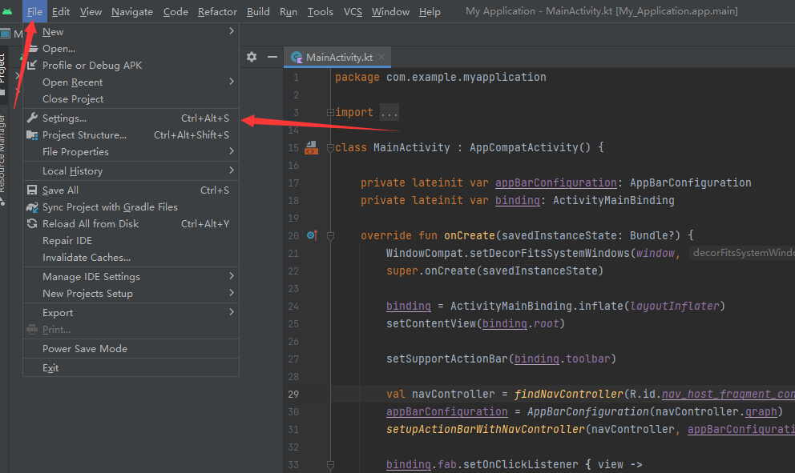
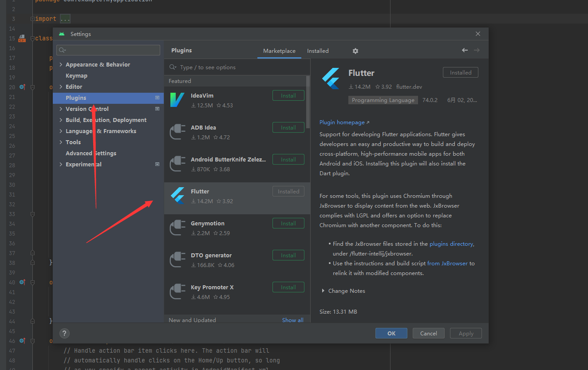
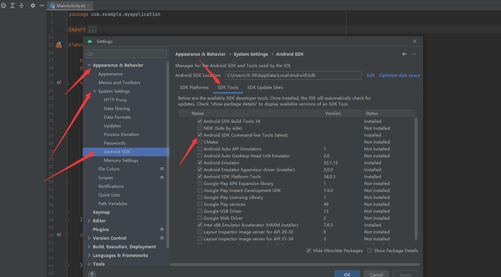
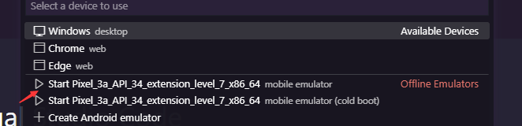
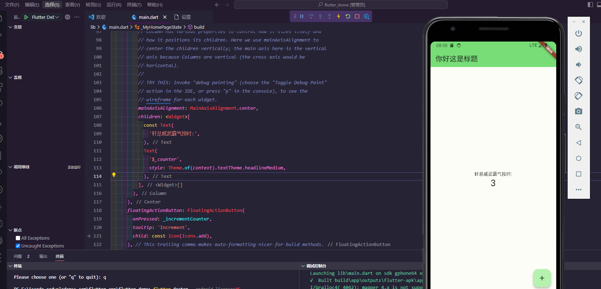

## 1.Run the Android environment in the flutter project in vs code

## 1.Install vs code

- [Visual Studio Code Official web](https://code.visualstudio.com/)
- [Visual Studio Code Chinese web](https://www.vscode.cool/)

## 2.Install Android Studio

- [Android Studio Official web](https://developer.android.google.cn/studio)
- Specific installation process but more introduction will not please Baidu
- in vs code  `Flutter`Execution under project `flutter doctor` command 
- Android Studio After the installation is complete, configure according to the following figure
  
### Android Studio First step

- 

### Android Studio The second step

- 

### Android Studio The third step

- 

### Android Studio Step four

- Restart `Android Studio` and the lack of flutter dependencies will pop up in the lower right corner. All you need to do is select Download All and wait until the download is complete

### Android Studio The fifth step

- Go back to vs code and run the `flutter doctor --android-licenses` command all the way Y

- Go back to vs code and execute `flutter doctor` Command discovery `Android Studio` Dependencies have been installed

- Select as shown
- 

- Go back to vs code and execute `flutter run -d xxxx` xxxYour device number is usually`Android`After selecting the serial number of the phone you can install it in the emulator if your phone is`Android`The system can also select your phone serial number to install

- That means you're a success
- 

## Contributors 

  

