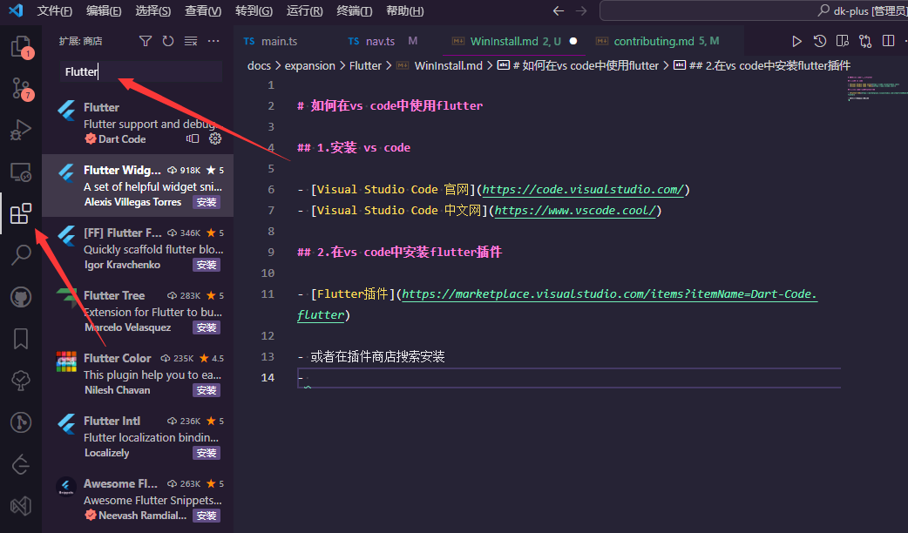
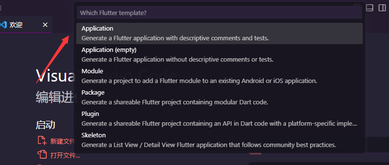
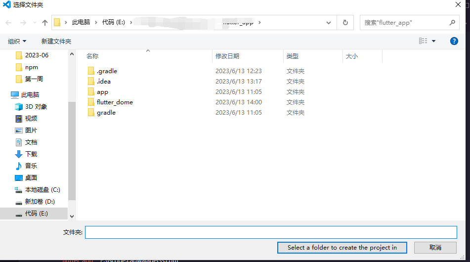
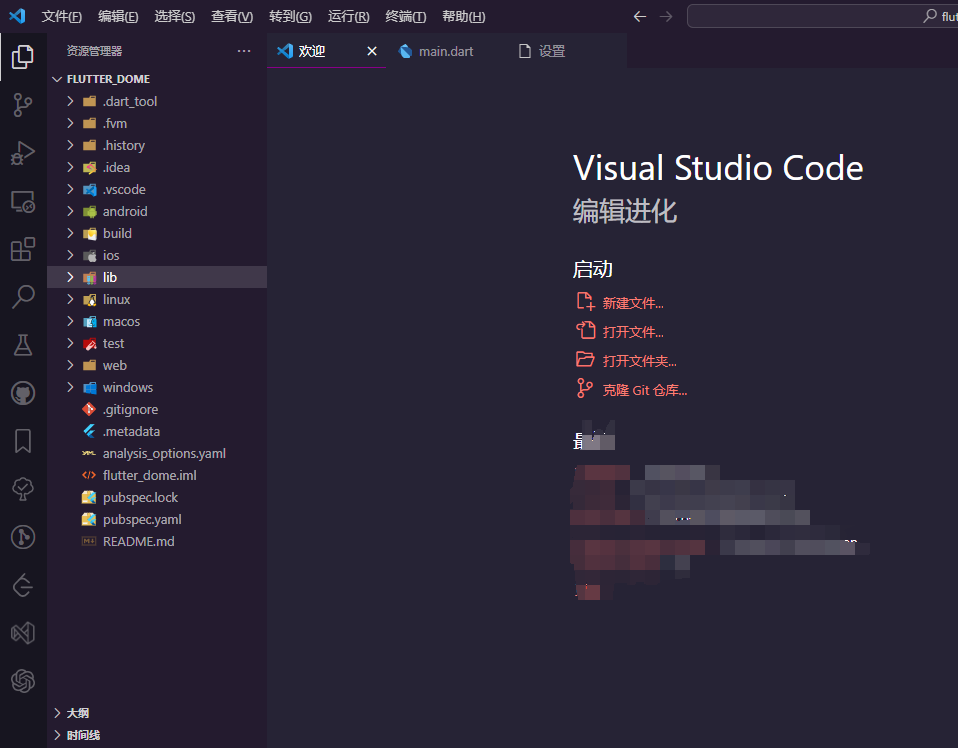
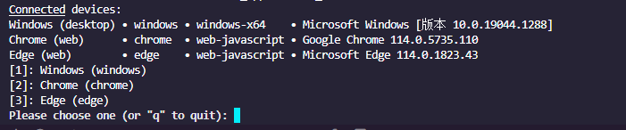
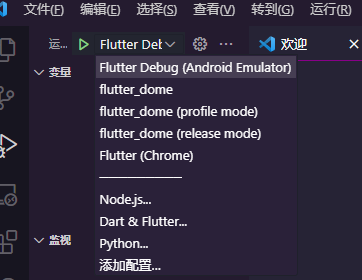

# 如何在vs code中使用flutter

## 1.安装 vs code

- [Visual Studio Code 官网](https://code.visualstudio.com/)
- [Visual Studio Code 中文网](https://www.vscode.cool/)

## 2.在vs code中安装flutter插件

- [Flutter插件](https://marketplace.visualstudio.com/items?itemName=Dart-Code.flutter)

- 或者在插件商店搜索安装
- 
- 安装完成后重启vs code
- 进入vs code 执行快捷键 `Ctrl+Shift+P` 输入 `flutter` 检查是否安装成功
- 如果成功搜索 `Flutter` 则会出现下图界面
- 
- 进入选择 `Flutter: New Project` 则会出现下图界面
- 
- 选择 `Application` 进入下图界面 项目存放路径 看你心情放哪都行
- 
- 输入目录后 创建项目会自动加载当前`Flutter SDK`版本 所需要的包 如下不下来请科技上网
- 创建成功后如图
- 
- 执行启动项目 flutter run  就会看到版本运行
- 
- 选择序号即可
- 如想项目弱更新按F5打开调试选择你选择的对应环境即可实现弱更新
- 

## Contributors 

  
  
  

