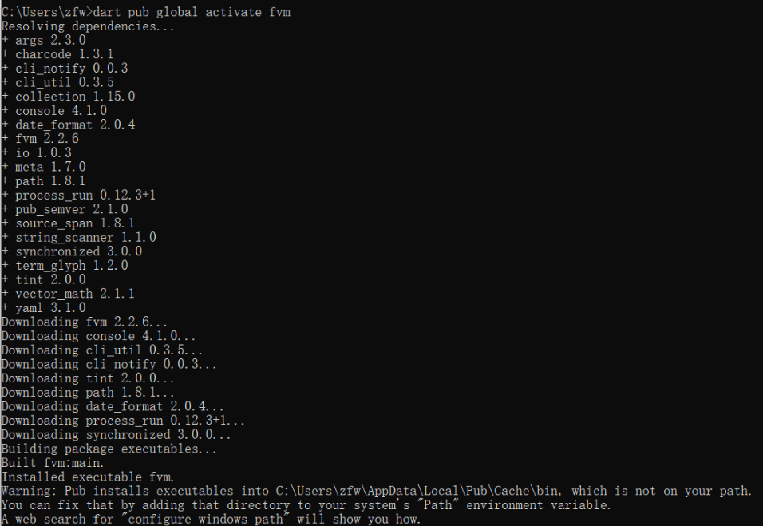
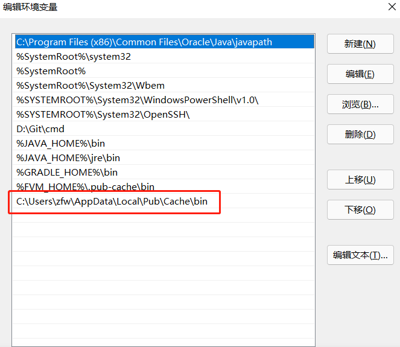

# win下使用fvm实现多个Flutter版本的切换

## 1. 安装fvm

- [配置 Dart 环境](https://gekorm.com/dart-windows/)
- mac 需要在所在市场下载安装
- 安装完成输入 `dart --version`  检测是否安装成功(需要管理员权限)
- 下载FVM  输入命令

```bash

dart pub global activate fvm

```

- 完成后如下图
- 
- 配置fvm环境变量(即配置FVM下载的位置)
- 
- 配置fvm下载flutter地址，不要下载到C盘
- cmd中输入fvm config --cache-path xxxx你电脑下载Flutter的位置
- 安装成功后,执行fvm install xxxx 指定版本号
- 如何查看版本号 `fvm releases`  命令 下载你需要的版本
- 如何切换版本 `fvm use xxxx`  命令 PS你需要注意的是你必须在项目目录下执行此命令并且拥有管理员权限 不然 会报错
- 然后再去你的vscode 去执行flutter run 就会看到你切换的版本了

## Contributors 

<div style='display: flex;'>
  <a href="https://github.com/isMrFan" title="Mr. Fan"  target="_blank" style='margin-right:10px;'>
    
  </a>
</div>
